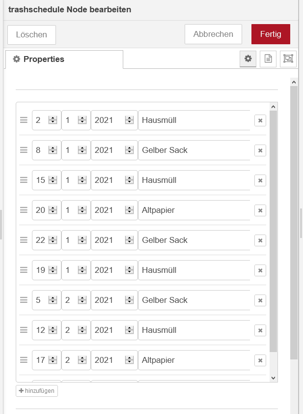
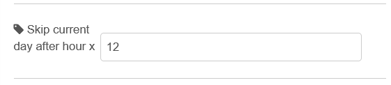
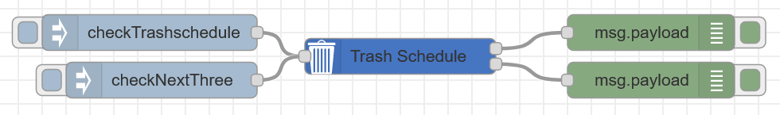

# Node Red Trash Schedule

[](https://www.npmjs.com/package/node-red-contrib-trashschedule)
[](https://www.npmjs.com/package/node-red-contrib-trashschedule)
[](https://github.com/MariusLang/node-red-contrib-trashschedule/issues)

[](https://nodei.co/npm/node-red-contrib-trashschedule/)

The **node-red-contrib-trashschedule** Node is the ultimative Node to manage your Trashschedule events.

Please make sure that you've picked the right timezone into your system settings!

## Installation
```
npm install node-red-contrib-trashschedule
```

## Node Description
### Settings
Add your trashschedule events into the list.



|field|required input                 |
|-----|-------------------------------|
|1    |event day (1-31)               |
|2    |event month (1-12)             |
|3    |event year (yyyy example: 2021)|
|4    |event name                     |

Select the hour until the trashschedule event will be displayed.



The last field "Name" gives the possibility to change the name which will be displayed for this node into your flow.

### Input
You can use the input to trigger events manually. The keywords are listed below.
|msg.payload             |output                               |
|------------------------|-------------------------------------|
|```checkTrashschedule```|return next trashschedule event      |
|```checkNextThree```    |return next three trashschedule event|

### Output
Every hour the node returns the next trashschedule event.
It returns the trashschedule events as an object. If there isn't a trashschedule event available you will receive the payload "Trashschedule events outdated".
|key  |value                 |
|-----|----------------------|
|name |event's name          |
|day  |event's day           |
|month|event's month         |
|year |event's year          |

## Example Flow


You can import this example into your Node Red flow.
```
[{"id":"16648316.40b675","type":"inject","z":"f250d57e.bf23e8","name":"","props":[{"p":"payload"}],"repeat":"","crontab":"","once":false,"onceDelay":0.1,"topic":"","payload":"checkTrashschedule","payloadType":"str","x":390,"y":2160,"wires":[["9046f677.54ca08"]]},{"id":"122515a7.53ba7a","type":"inject","z":"f250d57e.bf23e8","name":"","props":[{"p":"payload"}],"repeat":"","crontab":"","once":false,"onceDelay":0.1,"topic":"","payload":"checkNextThree","payloadType":"str","x":400,"y":2200,"wires":[["9046f677.54ca08"]]},{"id":"72c61c9d.7a7794","type":"debug","z":"f250d57e.bf23e8","name":"","active":true,"tosidebar":true,"console":false,"tostatus":false,"complete":"false","statusVal":"","statusType":"auto","x":810,"y":2160,"wires":[]},{"id":"adfd6af9.07d488","type":"debug","z":"f250d57e.bf23e8","name":"","active":true,"tosidebar":true,"console":false,"tostatus":false,"complete":"false","statusVal":"","statusType":"auto","x":810,"y":2200,"wires":[]},{"id":"9046f677.54ca08","type":"trashschedule","z":"f250d57e.bf23e8","name":"Trash Schedule","trashschedule":[{"name":"Hausmüll","day":2,"month":1,"year":2021},{"name":"Gelber Sack","day":8,"month":1,"year":2021},{"name":"Hausmüll","day":15,"month":1,"year":2021},{"name":"Altpapier","day":20,"month":1,"year":2021},{"name":"Gelber Sack","day":22,"month":1,"year":2021},{"name":"Hausmüll","day":29,"month":1,"year":2021},{"name":"Gelber Sack","day":5,"month":2,"year":2021},{"name":"Hausmüll","day":12,"month":2,"year":2021},{"name":"Altpapier","day":17,"month":2,"year":2021},{"name":"Gelber Sack","day":19,"month":2,"year":2021},{"name":"Test","day":28,"month":3,"year":2021},{"name":"Test2","day":29,"month":4,"year":2021}],"skipHour":"10","x":600,"y":2180,"wires":[["72c61c9d.7a7794"],["adfd6af9.07d488"]]}]
```
