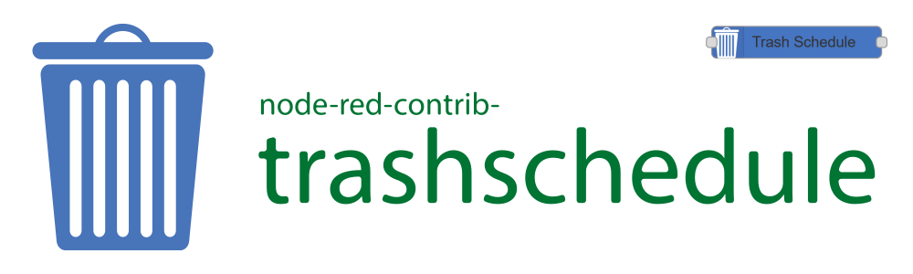

# Noder Red Trash Schedule

[](https://www.npmjs.com/package/node-red-contrib-trashschedule)
[](https://www.npmjs.com/package/node-red-contrib-trashschedule)
[](https://github.com/MariusLang/node-red-contrib-trashschedule/issues)

[](https://nodei.co/npm/node-red-contrib-trashschedule/)

The Node Red **Trashschedule** node is the ultimate node to create your own Trash Schedule.

## Installation
```
npm install node-red-contrib-trashschedule
```
